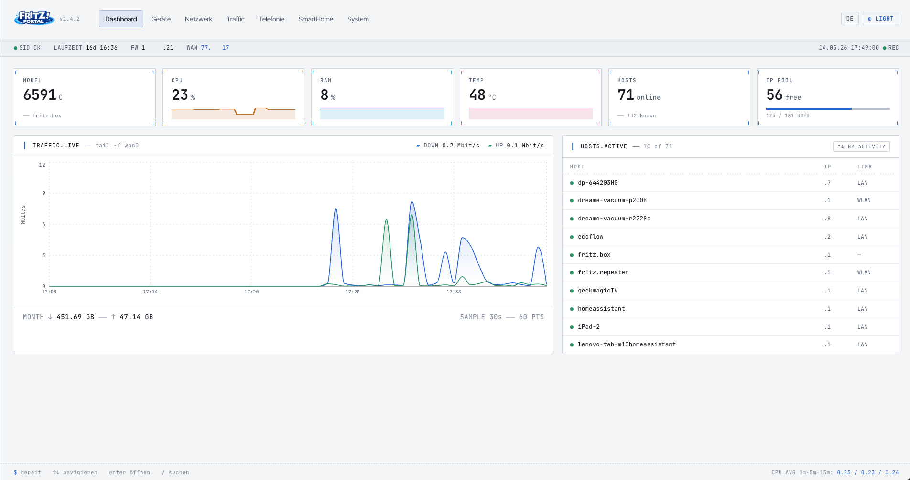
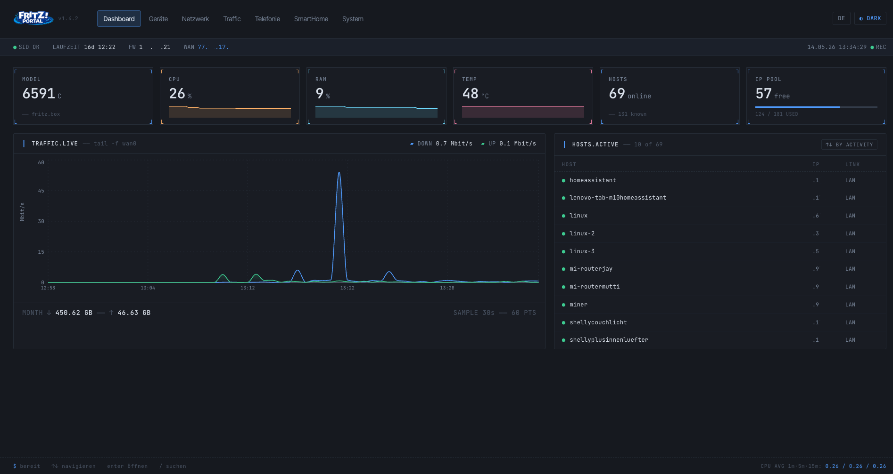
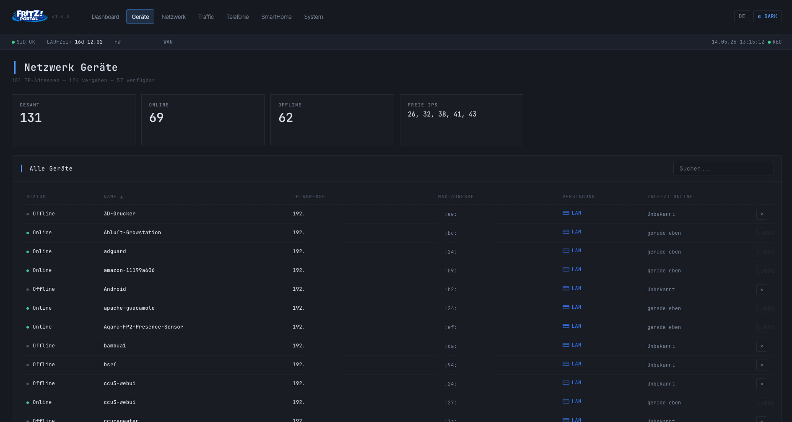
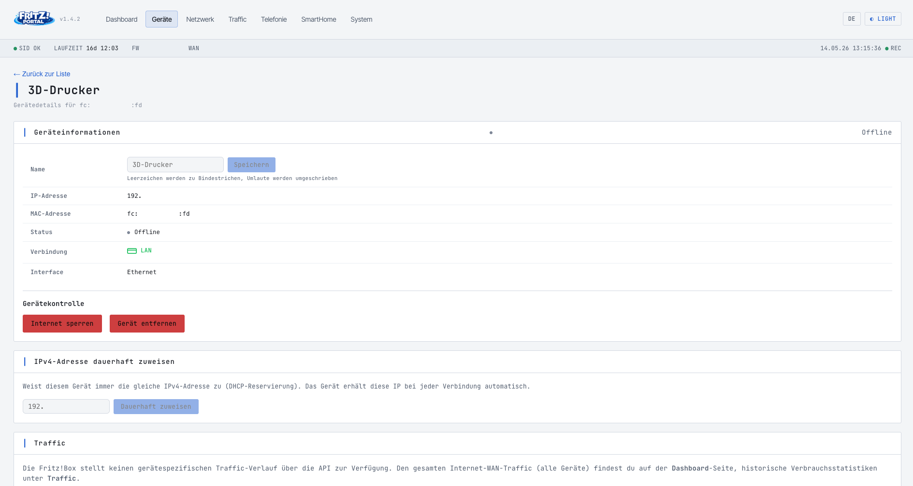
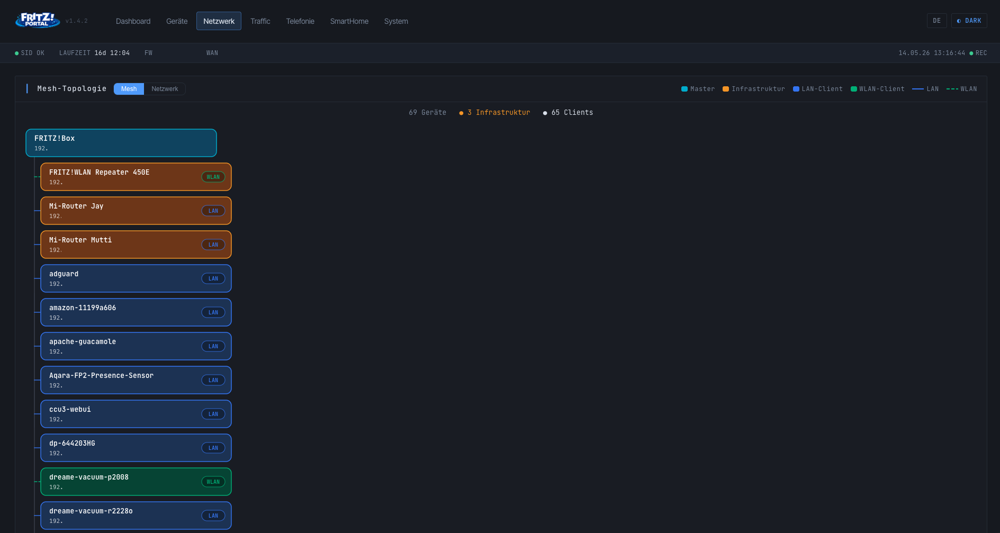
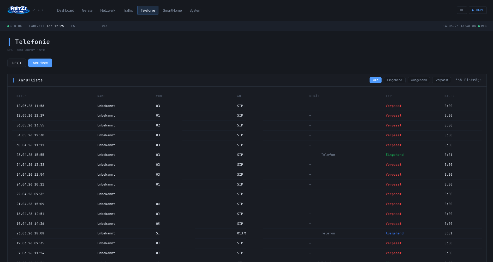
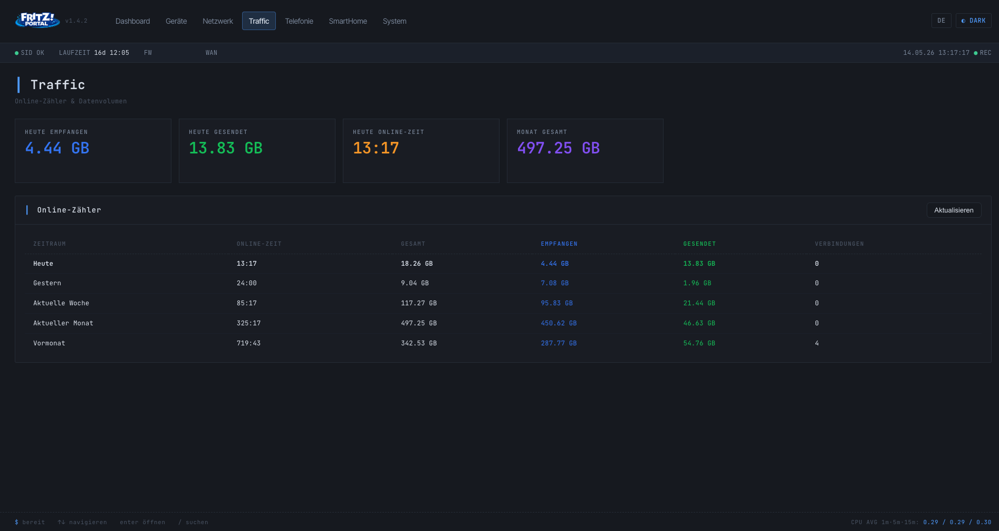

<p align="center">
  
</p>

<p align="center">
  <strong>The modern Fritz!Box dashboard as a Home Assistant App</strong><br/>
  Real-time overview, network topology, HA sensors and more – all in one elegant interface. Easily rename devices, assign new IP addresses or block unwanted hosts directly from the app. Fully integrated into the Home Assistant UI via Ingress.
</p>

<p align="center">
  
  
  
  
  
  <a href="README.md"></a>
</p>
<p align="center">
If you like the App, I would appreciate a Star rating ⭐ from you. 🤗 
</p>

<div align="center">
  
[](https://ko-fi.com/jayjojayson)
[](https://www.paypal.me/quadFlyerFW)
</div>

<p align="center">
    
   
  
  
  
  
  
</p>

---

## ✨ Features

| Area | What's included |
|---|---|
| **Dashboard** | 6 live tiles (model, CPU, RAM, temp, hosts, IP pool) with sparklines; `TRAFFIC.LIVE` chart and sortable `HOSTS.ACTIVE` list (by activity / IP / name) |
| **Device List** | All connected hosts with status, IP, MAC, connection type, sorting, search, internet blocking + **delete function for offline devices** |
| **Device Detail** | Rename device (with umlaut sanitiser), reserve a fixed DHCP IP, block/unblock internet, remove device from the FRITZ!Box list |
| **Network** | LAN, WAN, WLAN, DHCP – details at a glance; **Mesh topology visualisation** with mesh and radial network view; **WLAN on/off per SSID** (e.g. guest access); WLAN password editable inline |
| **Traffic** | Live download/upload chart (30 s tick, 30 min history) + statistics for Today, Yesterday, Week, Month, Last Month |
| **Telephony** | Call list (caller/called/device separated, type filter) and DECT handsets – **clean separation from SmartHome** (DECT actors like FRITZ!DECT 200/301 only appear under SmartHome) |
| **SmartHome** | Overview of all AHA devices (sockets, thermostats, sensors, RolloTron) with temperature, switch state and power consumption |
| **System** | Fritz!Box model, firmware, uptime, serial number, reboot function; HA sensor configuration, debug logging, „keep session alive" toggle |
| **HA Sensors** | CPU, RAM, temp, devices, free IPs, download, upload, traffic counters – automatically pushed as sensors to Home Assistant |
| **MQTT Discovery** | Default transfer method: all sensors are registered via MQTT as a grouped „FRITZ!Portal" device in the HA device overview |
| **REST API Fallback** | Optionally enabled for users without an MQTT broker – sensors then appear as individual entities |
| **Languages** | **Fully German / English** switchable via DE/EN pill in the header, selection is persisted |
| **Dark / Light Mode** | Reactive theme (TERMINAL.OS Slate · Blue) without page reload |
| **Ingress** | Full integration into the Home Assistant interface, no port forwarding required |

---

## 🚀 Installation in Home Assistant

### 1. Add the repository

1. In HA: **Settings → Apps → App Store**
2. Click **⋮ → Custom repositories** in the top right
3. Enter the URL:
   ```
   https://github.com/jayjojayson/FRITZ-Portal
   ```
4. Click **Add** → reload the page

### 2. Install the app

1. Search for **FRITZ!Portal** in the store and open it
2. Click **Install** (the build may take a few minutes)
3. Switch to **Configuration** and enter your credentials:

| Option | Description | Default |
|---|---|---|
| `fritzbox_host` | Hostname or IP of the Fritz!Box | `fritz.box` |
| `fritzbox_user` | Fritz!Box username | – |
| `fritzbox_password` | Fritz!Box password | – |
| `ha_sensors` | Enable REST API fallback (only needed without MQTT broker) | `false` |
| `ha_sensors_interval` | System sensor interval (seconds) | `60` |
| `ha_sensors_traffic_interval` | Traffic sensor interval (seconds) | `300` |
| `keep_session_alive` | Keep the FRITZ!Box session permanently open – required for continuous HA sensor updates even when the portal is not actively opened. **Increases load on the FRITZ!Box and can compete with HA's built-in Fritz!SmartHome integration** – only enable when the sensors really must be updated 24/7. | `false` |
| `debug_logging` | Log all API requests (TR-064, data.lua) to the protocol – useful for troubleshooting, otherwise leave off | `false` |

4. **Save → Start**
5. Open via **Web UI** or directly at `http://<ha-ip>:3003`

> **Note:** The app automatically logs in to the Fritz!Box with the configured credentials on startup – no manual login required.

> **Fritz!Box Permissions:** The Fritz!Box user you configure needs the following permissions, otherwise individual sections of the app will not work. Configurable in the **FRITZ!Box UI → System → FRITZ!Box Users → [Edit user]**:
>
> | Permission | Required for |
> |---|---|
> | **FRITZ!Box settings** | Model/firmware, CPU/RAM/temperature, reboot, WLAN configuration (incl. guest access on/off), DHCP reservations, deleting devices from the host list, internet blocking |
> | **Voicemail, fax messages, FRITZ!App Fon and call list** | Call list on the telephony page |
> | **Smart Home** | SmartHome devices (sockets, thermostats, sensors, blinds) |
> | **VPN** | optional, only if the box is reachable via VPN |
>
> Additionally the option **"Allow access for applications"** must be enabled under **Home Network → Network → Network Settings** – otherwise TR-064 requests are rejected with `401 Invalid Action`.

> **MQTT Discovery:** FRITZ!Portal **always sends sensor data via MQTT** to Home Assistant automatically. All sensors are registered as a single **„FRITZ!Portal"** device in the HA device overview, where they can be individually renamed, categorised and used on dashboards.
>
> **No MQTT broker available?** Enable the **REST API fallback** in the app configuration (`ha_sensors: true`) or directly in the FRITZ!Portal GUI. Sensors will then appear as individual entities under *Settings → Entities*. To avoid duplicate entities, only one method should be active at a time.
>
---

## 🖥️ Compatible FRITZ!Box Models

FRITZ!Portal works in principle with all FRITZ!Box models that support TR-064 and `data.lua`.
The following models have been tested by users and work well:

| Model | Status | Notes |
|---|---|---|
| FRITZ!Box 7590 | ✅ Good | Fully supported |
| FRITZ!Box 7590 AX | ✅ Good | DECT fix since v1.3.8 |
| FRITZ!Box 7530 | ✅ Good | DSL/PPPoE; mesh view limited (Issue #5) |
| FRITZ!Box 6690 Cable | ✅ Good | DECT fix since v1.3.8 |
| FRITZ!Box 6591 Cable | ✅ Good | Fully supported since DHCP fallback via data.lua since v1.2.6 |
| FRITZ!Box 6490 Cable | ✅ Good | Model detection and IP stats via fallback since v1.2.5 |
| FRITZ!Box 6860 5G | ⚠️ Under Review | Issues reported (Issue #20) |

> **Note:** Models not listed here may also work – they simply haven't been explicitly tested yet.

---

## 🐳 Build & test locally with Docker

For development and testing without Home Assistant:

```bash
# Clone the repository
git clone https://github.com/jayjojayson/FRITZ-Portal.git
cd FRITZ-Portal/fritz-portal

# Build the Docker image
docker build -t fritz-portal-app .

# Start the container (auto-login via environment variables)
docker run --rm -p 3003:3003 \
  -e FRITZBOX_HOST=fritz.box \
  -e FRITZBOX_USER=admin \
  -e FRITZBOX_PASSWORD=secret \
  fritz-portal-app
```

Then open in your browser: **http://localhost:3003**

### Frontend development only (Vite Dev Server)

```bash
cd fritz-portal
npm install
npm run dev
```

The dev server runs at **http://localhost:5173** and proxies API requests automatically to the running Express server.

---

## 📋 Changelog

The full version history can be found in [CHANGELOG.md](fritz-portal/CHANGELOG.md).

---

<p align="center">
  Made with ❤️ for the Home Assistant community
</p>
